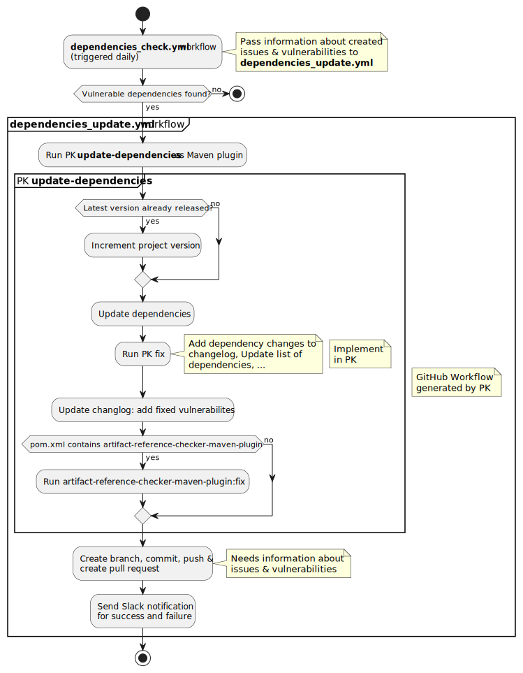
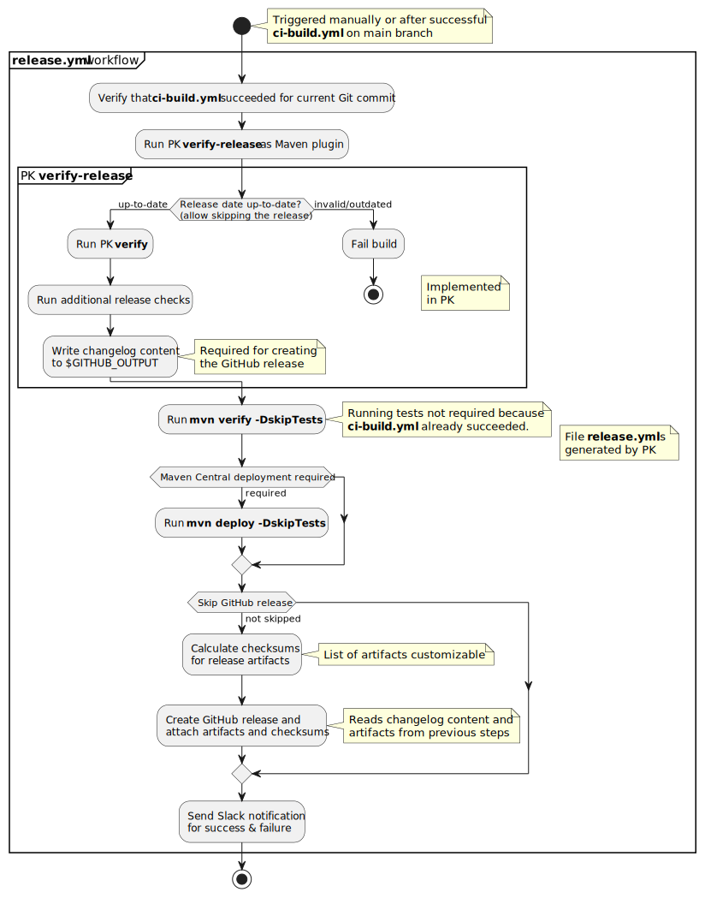

# Design

## Validators

`dsn~validators~1`

As an interface for the different validations, we created the `Validator` interface. It only contains the `validate` method:

```java
public List<ValidationFinding> validate();
```

The `ValidationFinding` consists of:

* A message
* An optional fix for the violation finding

A fix is a function closure that changes the project so that the fixed finding does not happen again.

We decided on this interface since it allows us to:

* Report errors that can't be fixed automatically
* Report an error and directly provide a fix for it

A problem with this approach is that some validation fixes change a resource such as files. If a validator creates multiple validation findings for the same resource, each fix needs to read and write the file.

Consider, for example, the plugin validator for the pom file. If the pom file validator detects multiple missing plugins, each of these fixes would need to write the file since the fixes are executed by the surrounding code and not in a specific order. To solve this, we used the trick to create a compound finding. So basically one finding with one error message that combines one of all its sub findings. Its fix is a method that runs the fixes of all sub-findings and then writes the pom file.

Covers:

* [`feat~fix-findings~1`](system_requirements.md#fix-findings)

Needs: impl


### Project Keeper Verifies Own Version
`dsn~verify-own-version~1`

PK is able to detect its own current installed version, retrieve the latest version available for download, and to validate if the current version is not older than the latest available.

All findings related to detecting and verifying its own version are optional.

Rationale: Releasing a new version of PK should not break automated builds of existing projects using PK.

Covers:

* [`feat~self-update~1`](system_requirements.md#self-update)

Needs: impl, utest, itest

### Project Keeper Self Update
`dsn~self-update~1`

PK performs self-update only for Maven projects.

Rationale: CLI users can use PK by executing a jar file with arbitrary location in the file system.
* This location might be unknown to PK and could be read-only.
* Replacing the jar file should be up to the human user.
* Update of PK CLI variant is simple as it just requires to download the latest jar.
* Scope and effort for update is probably small, as most users will probably use a common jar file for all of their projects instead of having a versioned maven plugin reference for each individual maven project.

Covers:

* [`feat~self-update~1`](system_requirements.md#self-update)

Needs: impl, utest, itest

### Required Files Validator

`dsn~required-files-validator~1`

We decided to add the template as resources and describe them in a Java structure (`FileTemplates`).

Covers:

* [`req~verify-existence-of-files~1`](system_requirements.md#verify-existence-of-files)

Needs: impl, utest, itest

### Deleted Files Validator

`dsn~deleted-files-validator~1`

For configuring the deleted files validator we decided on a Java API. For each deleted file PK developers must specify a reason that will be printed as an error message. By that PK can for example tell that the file was moved.

Covers:

* [`req~verify-non-existence-of-files~1`](system_requirements.md#verify-non-existence-of-files)

Needs: impl, utest, itest

### Pom File Validator

`dsn~pom-file-validator~1`

PK generates a second pom file based on the configuration. This file contains the default plugins and dependencies. This file is not meant to be edited by the user.

PK configures the main pom file of the project to use the generated one as a parent. By that users can add additional configuration and also override the generated template.

This approach has the advantage that it separates autogenerated configuration from user-defined configuration.

If a project needs a parent file, users can specify this parent in the PK config. PK will then use this parent as a parent for the autogenerated pom.

Covers:

* [`req~verify-mvn-plugins~1`](system_requirements.md#verify-maven-plugins)
* [`req~verify-maven-dependencies~1`](system_requirements.md#verify-maven-dependencies)

Needs: impl, utest, itest

#### Alternatives

Until version 2.0.0 we used a different approach:

We had only one pom file that was meant to be edited by the users. PK checked some constrains and could also fix them. For example check if a certain plugin is defined.

This approach failed because a pom file can express the same thing often in multiple ways. For example a plugin's config can be in `configuration/` or in `executions/execution/configuration`. Since we only validated the XML, reflecting this flexibility got too complex.

Another problem was, that in multi maven module projects PK enforced the same plugins in all pom files, which is a lot of duplication. That's also true for the current approach, but there it's in files with generated content only. There duplication is not such a problem.

### Dependency Changes Section in changes_x.x.x.md File Validator

`dsn~dependency-section-in-changes_x.x.x.md-file-validator~1`

The basic approach for this validator is to generate the markdown for the `Dependency Changes` section and then compare the content of the project's file with that generated content. In case they differ the validation fails. The automatic fix of the validation error is to override the section with the generated one.

For this feature we need to generate the list of dependency changes since the last release. We decided to generate this list by comparing the dependencies of the last release with the dependencies of the current release.

For both versions we [read the project's dependencies](#reading-project-dependencies) and create a Java model that we then compare to extract the differences.

For getting the last release we use Git. We detect the previous release by walking through the commits on the current branch in reverse order. If we find a tag that looks like a version number we extract the `pom.xml` file from this commit and analyze its dependencies.

We separated the crawling of the dependencies from the rendering of the table so that we can add different crawlers for other languages or build systems in the future.

Needs: impl, utest, itest

Covers:

* `req~verify-dependency-section-in-changes_x.x.x.md-file~1`

### Changelog.md File Validator

`dsn~verify-changelog-file~1`

For validating the `changelog.md` file we first generate the expected content and then compare the actual file with the expected content.

Covers:

* [`req~verify-changelog-file~1`](system_requirements.md#verify-changelog.md-file)

Needs: impl, utest, itest

### Dependencies.md File Validator

`dsn~dependency.md-file-validator~1`

For validating the `dependencies.md` file we first generate the expected content and then compare the actual file with the expected content.

For generating the content we first [read the project's dependencies](#reading-project-dependencies) and then use the maven API to get the project information. To do so, we again use the maven `ProjectBuilder`. This maven class can fetch a dependency from the maven repository (local or remote) and provide a Java representation of the pom file.

We separated the crawling of the dependency information from the rendering of the files so that we can add support for different languages or build systems in the future.

Covers:

* [`req~verify-dependencies-file~1`](system_requirements.md#verify-dependencies.md-file)

Needs: impl, itest

#### Excluding Implicit Plugins from Dependencies.md

`dsn~dependency.md-file-validator-excludes-implicit-plugins~1`

PK excludes implicit plugins from `dependencies.md`.

Rationale:

Maven implicitly adds plugins like `org.apache.maven.plugins:maven-clean-plugin` due to the Maven lifecycle. The version of these plugins depends on the Maven version. Each plugin version defines its own name and license which is included in `dependencies.md`. That means the content of `dependencies.md` depends on the Maven version, causing build failures when using a different Maven version, see [issue #436](https://github.com/exasol/project-keeper/issues/436).

One workaround is pinning the Maven version using `maven-enforcer-plugin` but this causes problems on developer's machines. That's why we decided to remove these implicit plugins from `dependencies.md`.

Needs: impl, utest, itest

### Readme.md File Validator

`dsn~readme-validator~1`

We decided that the readme validator should not be too strict. That means, that it should not enforce a specific structure but only check that the required parts are somewhere in the file. That also means, that the PK can't automatically fix the findings. By that PK makes sure the the `README.md` contains the required parts, but still leaves users a lot of freedom.

Needs: impl, utest, itest

Covers:

* [`req~verify-readme~1`](system_requirements.md#verify-readme.md-file)

### License File Validator

`dsn~license-file-validator~1`

We decided that the license validator only inserts the current year on creation. Another option would have been to add a year range and also validate that it's always up to date. However, since it's not very likely that these projects require a copyright longer than 50-70 years, we decided adding the creation year is enough. In case it still required one can of course add a date range by hand.

Needs: impl, utest, itest

Covers:

* [`req~verify-license-file~1`](system_requirements.md#verify-license-file)

### Gitignore Validator

`dsn~gitignore-validator~1`

Needs: impl, utest, itest

Covers:

* [`req~verify-gitignore-file~1`](system_requirements.md#verify-gitignore-file)

### Reading Project Dependencies

`dsn~reading-project-dependencies~1`

For reading the project's dependencies we decided to use the maven `ProjectBuilder`. Maven injects this object into the main class of PK maven plugin. In contrast to simply instantiating it, this approach introduces coupling and makes unit tests impossible. For that reason in the future, we might want to move the dependency discovery into a dedicated maven plugin and call it via `mvn exec` command.

Unit testing is not possible since `ProjectBuilder` needs to be injected by maven.

Needs: impl, itest

### Project Version Increment Validator
`dsn~version-increment-validator~1`

PK's `verify` mode checks that the current project version was incremented correctly based on the previous version.

Rationale:
* In the previous release process this was checked by release-droid in `CommonRepositoryValidator.validateSuccessor()`.

Covers:
* [`dsn~verify-release-mode~1`](#pk-mode-verify-release)

Needs: impl, utest, itest

## Maven Integration

### Maven Verify Goal

`dsn~mvn-verify-goal~1`

This plugin defines a maven goal named `verify` that checks if the project matches the defined structure. The default maven lifecycle phase for this goal is the `package` phase.

Covers:

* [`feat~mvn-integration~1`](system_requirements.md#maven-integration)

Needs: impl, itest

### Maven fix Gaol

`dsn~mvn-fix-goal~1`

This plugin defines a maven goal named `fix` that creates or updates the project files so that they match the required project structure.

Covers:

* [`feat~mvn-integration~1`](system_requirements.md#maven-integration)

Needs: impl, itest

### Use Maven Toolchain
`dsn~mvn-toolchain~1`

PK generates build scripts with the following changes:
* `pk_generated_parent.pom` contains `maven-toolchains-plugin`, using toolchain version `${java.version}`.
  * This ensures that the same toolchain version is used for the build as the configured Java version.
  * Plugins like `maven-compiler-plugin` and `maven-surefire-plugin` use the toolchain configured in `${java.version}`.
    * This is an improvement over Maven's default behavior to use the Java version of `JAVA_HOME` for compiling and testing. This caused problems when JDK 17 was installed but the project requires a build with JDK 11. The user had to manually override `JAVA_HOME` to point to JDK 11 in order to fix the build.
  * This allows projects to override the Java version in their `pom.xml` file using the `<properties>` element.
* `pk_generated_parent.pom` configures `maven-enforcer-plugin` to require Java 17 for the build.
  * This ensures that builds fail early in case an older JDK is used.
* All GitHub workflows `.github/workflows/*.yml` install both Java versions 11 and 17 using action `actions/setup-java`.
  * Action `actions/setup-java` automatically generates `~/.m2/toolchains.xml` with the paths to the installed JDKs.
  * PK specifies Java 17 as the last option, making it the default for the build. This means that Maven will automatically use Java 17 for running the build and plugins.

Users will need to do the following:
* Install both JDKs 11 and 17 locally on their machines
* Configure environment variable `JAVA_HOME` to point to JDK 17
* Create `~/.m2/toolchains.xml` pointing to JDKs 11 and 17.

PK's user guide describes how to do this.

Covers:

* [feat~mvn-multiple-java-versions~1](system_requirements.md#support-building-with-multiple-java-versions)

Needs: impl, utest

### Generate `.settings/org.eclipse.jdt.core.prefs` with Java Version
`dsn~eclipse-prefs-java-version~1`

PK generates Eclipse config file `.settings/org.eclipse.jdt.core.prefs` with the correct Java version:
* If `pom.xml` contains property `java.version`, PK uses this version
* If `pom.xml` does not contain property `java.version`, PK uses `11` as default

Rationale:

IDEs like Eclipse or VS Code modify `.settings/org.eclipse.jdt.core.prefs` when loading projects with Java version different from the default `11`. Generating the file with the correct version avoids excluding the file from PK.

Needs: impl, utest, itest

## Non-Maven Integration
`dsn~pk-verify-workflow~1`

For projects that don't contain a Maven module in the root folder, PK generates the following files:

- `.github/workflows/project-keeper.sh`: This bash script downloads Project Keeper using `maven-dependency-plugin` and runs it.
- `.github/workflows/project-keeper-verify.yml`: This GitHub workflow runs for every build and calls the script above.

Rationale:

* Projects that contain a Maven module in the root folder can use the default [Maven verify goal](#maven-verify-goal) and don' require this separate workflow and script.
* Users can call the bash script manually with the `fix` option to automatically fix issues with the build scripts.

Covers:

* [`feat~non-mvn-integration~1`](system_requirements.md#integration-for-non-maven-projects)

Needs: impl, itest

## Configuration

### Modules

`dsn~modules~1`

We decided to group sets of validations into modules. These modules represent typical use cases. For example one module is `maven_central` which contains the validations for publishing to Maven Central Artifact Repository.

Covers:

* [`feat~configuration~1`](system_requirements.md#configuration)

Needs: impl, utest

### Excluding Validation Findings

`dsn~excluding~1`

We added the possibility to exclude validation findings.

We decided for an exclude-mechanism where users provide regular expressions that match the messages to exclude.

That allows users to define all kinds of validation findings. In addition, it does not add coupling between config and possible validations.

Rationale:

* Some projects need a non-default configuration
* It helps trying something out

Covers:

* [`feat~configuration~1`](system_requirements.md#configuration)

Needs: impl, utest, itest

### Customize Release Artifacts
`dsn~customize-release-artifacts~0`

PK allows customizing the list of files that are attached to new GitHub releases in the `release.yml` workflow.

Needs: dsn
Covers:
* [`req~customize-release-artifacts~0`](system_requirements.md#customize-release-artifacts)

#### Archive Configured JAR Artifact
`dsn~customize-release-artifacts-jar~0`

PK adds the JAR name configured in the `maven-assembly-plugin` to the list of release artifacts.

Rationale:
* This avoids duplicating configuration already present in `pom.xml`.
* This requires evaluating placeholders, e.g. `document-files-virtual-schema-dist-${vs-common-document-files.version}-s3-${project.version}`.

Covers:
* [`dsn~customize-release-artifacts~0`](#customize-release-artifacts)

-Needs: impl, utest, itest

#### Common List of Release Artifacts
`dsn~customize-release-artifacts-hard-coded~0`

PK adds the following files to a hard coded list of release artifacts:
* `target/error_code_report.json`

Rationale:
* These files are created by all projects.
* Hard coding this list in PK avoids duplication in the `.project-keeper.yml`

Covers:
* [`dsn~customize-release-artifacts~0`](#customize-release-artifacts)

-Needs: impl, utest, itest

#### Custom Release Artifacts
`dsn~customize-release-artifacts-custom~0`

PK adds a list of configured files to the list of release artifacts.

Rationale:
This allows adding project-specific release artifacts like `.js` extensions.

Covers:
* [`dsn~customize-release-artifacts~0`](#customize-release-artifacts)

-Needs: impl, utest, itest

### Customize Build Process
`dsn~customize-build-process~0`

Covers:

* [`req~customize-build-process~0`](system_requirements.md#customize-build-process)

## Golang Support

### Get Project Version

`dsn~golang-project-version~1`

PK reads the project version directly from the configuration file. Only a fixed version is supported.

Rationale:

Golang does not store the version number in project files, e.g. `go.mod`. The version is only defined by a tag of the Git repository.

Covers:

* [`req~golang-project-version~1`](system_requirements.md#get-project-version)

Needs: impl, itest

### Get Licenses of Dependencies

`dsn~golang-dependency-licenses~1`

PK uses the [go-licenses](https://github.com/google/go-licenses/) project for retrieving the licenses of the dependencies.

Rationale:

go-licenses is a simple command line tool that outputs the license name and license URL as CSV. Installing it is easy and creating our own tool is a lot of effort.

Covers:

* [`req~golang-dependency-licenses~1`](system_requirements.md#get-licenses-of-dependencies)

Needs: impl, itest

### Get Changed Dependency
`dsn~golang-changed-dependency~1`

PK parses the `go.mod` file to get the changed dependencies since the last release. PK ignores dependencies marked with an `// indirect` comment.

Rationale:

* The `go.mod` format is simple and easy to parse.
* Using a command like `go list -m -f '{{if not (or .Indirect .Main)}}{{.Path}}{{end}}' all` would require checking out the complete sources of the last release tag. The `go.mod` file is not enough to run this command.
* Adding indirect dependencies to the changes list would make it hard to read, because this list can become very long.
* It is a convention in Go projects to mark indirect dependencies with an `// indirect` comment. The `go mod tidy` enforces this automatically.

Covers:

* [`req~golang-changed-dependency~1`](system_requirements.md#get-changed-dependency)

Needs: impl, utest, itest

## NPM Support

### Get Project Version
`dsn~npm-project-version~1`

PK reads the project version from file `package.json`.

Covers:
* [`req~npm-project-version~1`](system_requirements.md#get-project-version)

Needs: impl, itest

### Get Additional Information About Dependencies
`dsn~npm-dependency-additional-information~1`

PK uses the command `npm list` for retrieving additional information of the dependencies such as the URL for obtaining the artifacts of the dependency.

Covers:
* [`req~npm-dependency-additional-information~1`](system_requirements.md#get-additional-information-for-each-dependency)

Needs: impl, utest, itest

### Get Licenses of Dependencies
`dsn~npm-dependency-licenses~1`

PK uses the NPM `license-checker` for retrieving the licenses of the dependencies.

Rationale:

NPM `license-checker` is a simple command line tool that outputs the license name and license URL as Json. Using `npx` enables to use the `license-checker` even without installation.

Covers:
* [`req~npm-dependency-licenses~1`](system_requirements.md#get-licenses-of-dependencies)

Needs: impl, utest, itest

### Get Changed Dependency
`dsn~npm-changed-dependency~1`

PK parses file the `package.json` to get the changed dependencies since the last release.

Covers:
* [`req~npm-changed-dependency~1`](system_requirements.md#get-changed-dependency)

Needs: impl, utest, itest

## Automatic Dependency Update Process

This consists of the following steps:
1. Trigger the dependency update process
2. Update dependencies
3. Create a pull request



### Triggering the Dependency Update Process
`dsn~trigger-dependency-updates~1`

PK generates the `dependencies_check.yml` GitHub workflow so that it launches the `dependencies_update.yml` workflow when it detects new vulnerabilities.

Rationale:

`dependencies_check.yml` already uses the [security-issues](https://exasol.github.io/python-toolbox/github_actions/security_issues.html) tool from the [python-toolbox](https://github.com/exasol/python-toolbox) to create issues for new vulnerabilities. Re-implementing this in PK is not necessary.

Covers:
* [`req~auto-update-dependencies~1`](system_requirements.md#auto-update-dependencies)

Needs: impl

### Update Dependencies Mode
`dsn~update-dependencies-mode~1`

PK provides an `update-dependencies` mode in addition to `fix` and `verify`. This mode performs the following steps:

1. Increment version of the project
2. Update dependencies to their latest version
3. Create changelog containing information about the fixed vulnerabilities (if available)

Rationale:

* We implement this in PK because
  * PK already contains code for working with versions and changelog, so we can reuse this code
  * The `update-dependencies` mode is also useful for running locally on the developer's machine when working on a non-security related task
* We don't implement git/GitHub operations in PK because
  * This would couple PK to GitHub
  * This would be surprising when running it locally
  * This would require credentials for accessing the GitHub API

Covers:
* [`req~auto-update-dependencies~1`](system_requirements.md#auto-update-dependencies)
* [`req~auto-create-changelog~1`](system_requirements.md#automatically-create-change-log-entry)

Needs: dsn

#### Incrementing the Project Version
`dsn~dependency-updater.increment-version~1`

PK increments the project's patch version. PK does not modify the version if the current version was not yet released (i.e. there is not release in the latest changelog file).

Rationale:

Leaving the version unchanged when it was not yet released avoids surprises when running this locally.

Covers:
* [`dsn~update-dependencies-mode~1`](#update-dependencies-mode)

Needs: impl, utest, itest

#### Update Dependencies
`dsn~dependency-updater.update-dependencies~1`

PK updates dependencies using the [versions-maven-plugin](https://www.mojohaus.org/versions/versions-maven-plugin/index.html):

```sh
mvn versions:use-latest-releases && mvn versions:update-properties
```

Rationale:

* This avoids re-inventing the wheel.
* The plugin supports excluding dependencies from the update that could cause problems using the [`<excludes>`](https://www.mojohaus.org/versions/versions-maven-plugin/use-latest-releases-mojo.html#excludes) configuration.

Covers:
* [`dsn~update-dependencies-mode~1`](#update-dependencies-mode)

Needs: impl, utest, itest

#### Retrieve Vulnerability Information
`dsn~dependency-updater.read-vulnerability-info~1`

PK reads the information about potentially fixed vulnerabilities in dependencies from Java System Property `project-keeper:vulnerabilities` in JSONL format.

Rationale:
* The `dependencies_check.yml` workflow detects vulnerabilities and creates issues. It outputs information about the created issues and the vulnerabilities. This information is passed to the workflow `dependencies_update.yml` as a parameter which forwards it to PK via the system property.
* Using a system property instead of a file avoids reading from disk.
* Using a system property instead of a command-line argument avoids extracting the parameter from the command line.
* This will only be used in an automatic workflow, not by a user.

Covers:
* [`dsn~update-dependencies-mode~1`](#update-dependencies-mode)

Needs: impl, utest, itest

#### Generate Changelog
`dsn~dependency-updater.update-changelog~1`

PK generates the changelog for the fixed vulnerabilities if the required information is available. The changelog contains the following information:
* Issues that fix the vulnerabilities
* CVE-number, description and severity of each vulnerability
* The vulnerable dependency, its version and scope 

PK does not update the changes file if no information is available.

Rationale:
* Vulnerability information must be optional in order to allow running the process locally or to trigger the GitHub action manually.

Covers:
* [`dsn~update-dependencies-mode~1`](#update-dependencies-mode)

Needs: impl, utest, itest

### Generate `dependencies_update.yml` workflow
`dsn~dependency-updater.workflow.generate~1`

PK generates the `dependencies_update.yml` GitHub workflow.

Covers:
* [`req~auto-update-dependencies~1`](system_requirements.md#auto-update-dependencies)
* [`req~auto-create-changelog~1`](system_requirements.md#automatically-create-change-log-entry)
* [`req~auto-create-pr~1`](system_requirements.md#automatically-create-a-pull-request)

Needs: dsn, impl, utest

#### `dependencies_update.yml` Workflow Receives Vulnerability Info
`dsn~dependency-updater.workflow.vulnerability-info~1`

PK generates the `dependencies_update.yml` workflow so that it receives information about vulnerabilities and issues as optional parameter.

Needs: impl

Covers:
* [`dsn~dependency-updater.workflow.generate~1`](#generate-dependencies_updateyml-workflow)

#### Workflow `dependencies_update.yml` Starts PK Mode `update-dependencies` 
`dsn~dependency-updater.workflow.start-pk-update~1`

PK generates the `dependencies_update.yml` workflow so that it starts PK's [`update-dependencies` mode](#update-dependencies-mode), passing information about vulnerabilities.

Rationale:

PK needs the vulnerability info for generating the changelog.

Needs: impl

Covers:
* [`dsn~dependency-updater.workflow.generate~1`](#generate-dependencies_updateyml-workflow)

#### `dependencies_update.yml` Workflow Starts PK `fix` Mode Twice
`dsn~dependency-updater.workflow.start-pk-fix~1`

PK generates the `dependencies_update.yml` workflow so that it starts PK's `fix` mode twice after updating dependencies.

Rationale:

* After updating dependency versions, the workflow runs PK `fix` to update the dependencies section in the changes file.
* PK `fix` will potentially update PK to a newer version in `pom.xml` (see [`dsn~self-update~1`](#project-keeper-self-update)). So the workflow runs PK `fix` a second time (using the updated PK version) to update all generated files.

Needs: impl

Covers:
* [`dsn~dependency-updater.workflow.generate~1`](#generate-dependencies_updateyml-workflow)

#### `dependencies_update.yml` Workflow Creates a Pull Request
`dsn~dependency-updater.workflow.create-pull-request~1`

PK generates the `dependencies_update.yml` workflow so that it creates a Pull Request in GitHub. This requires the following steps:
1. Create a new local branch using a random name
2. Commit local changes using a commit message that contains the issue number
3. Push the branch
4. Create a new pull request with `Closes` comments for each issue number
5. If the Slack notification URL is available as secret: send a Slack notification
  * If the workflow fails: send a warning containing the workflow run
  * If the workflow succeeded: send a success message containing the pull request link

Rationale:

We implement this in a workflow and not in PK because
* Git/GitHub operations should not be done locally to avoid surprises
* GitHub action automatically have credentials for pushing and creating a pull request
* The Slack notification URL might not be available as secret to all repositories, so this step must be optional
* Sending notifications to developers to
  * investigate a failed update process
  * review and merge a new pull request

Note: Implementing this in a workflow makes it hard to do integration tests. We accept that there are no integration tests for running the workflow.

Needs: impl

Covers:
* [`dsn~dependency-updater.workflow.generate~1`](#generate-dependencies_updateyml-workflow)

#### Workflow `dependencies_update.yml` Requires to Trigger Pull Request CI Build Manually
`dsn~dependency-updater.workflow.pull-request-trigger-ci-build~1`

PK generates the `dependencies_update.yml` workflow so that it adds a note to the [created Pull Request](#dependencies_updateyml-workflow-creates-a-pull-request) that instructs the user how to trigger the CI build for the Pull Request.

Rationale:

* When the `dependencies_update.yml` creates the PR with dependency updates using the default `GITHUB_TOKEN`, the checks for this PR don't run initially.
  * See the [GitHub documentation](https://docs.github.com/en/actions/using-workflows/triggering-a-workflow#triggering-a-workflow-from-a-workflow) about triggering workflows with `GITHUB_TOKEN`.
* This [list](https://github.com/peter-evans/create-pull-request/blob/main/docs/concepts-guidelines.md#triggering-further-workflow-runs) suggests possible workarounds for triggering the PR checks:
  * Tell the user to modify the PR (e.g. by closing and reopening it)
  * Use an alterative GitHub token for creating the PR, i.e. a Personal Access Token (PAT) or a GitHub App Token
* We decided to accept the inconvenience of the manual step and avoid the trouble of configuring the additional token.
* If necessary we can chose a different implementation later.

Needs: impl

## Automated Release Process

### Generate Workflow `release.yml` 
`dsn~release-workflow.generate~1`

PK generates the `release.yml` GitHub workflow for Maven projects. This workflow runs the build, releases to Maven Central and on GitHub.

Rationale:
* The release process is limited to Maven projects. Support for other projects may be added later.
* The previous build process with release-droid used separate steps for testing and releasing. This allowed re-starting a release (e.g. to Maven Central) in case of failures, without having to start potentially long running tests (~40 minutes).
  * The new process always runs the complete process, it's not possible to skip tests.
  * We accept this disadvantage of potential slow release times for now because the release process to Maven Central is usually stable nowadays.
* We implement the workflow purely with a single generated GitHub actions. An alternative would be to implement parts of the build logic (e.g. checksum of build artifacts) as workflow steps implemented in JavaScript.
  * Advantages:
    * All generated code is one file, no need to use multiple files or reference other workflows
    * Simple, standalone implementation
  * Disadvantage:
    * Long generated workflow file
    * Not easily testable, one option would be [nektos/act](https://github.com/nektos/act)
  * We accept the disadvantages for now. However the architecture allows changing this in the future.
* Tests are excluded, see [rationale](#workflow-releaseyml-does-not-run-tests).



Covers:
* [`req~auto-release~1`](system_requirements.md#automatic-release)

Needs: dsn

#### Workflow `ci-build.yml` Starts Release Build After Succeeding on `main`
`dsn~release-workflow.ci-build-starts-release~1`

PK generates the `ci-build.yml` workflow so that it starts the `release.yml` workflow when all tests succeeded on the `main` branch.

Rationale:
* Starting the release automatically avoids manual work.
* In case no release is planned, developers enter an invalid date into the changes file. This will cause `release.yml` to cancel the release.
* Hard-coding the `main` branch is OK because we assume that all repositories use the same development workflow.
* This feature is implemented as GitHub workflow without tests. Hence, there is no requirement-tracing to tests.

Covers:
* [`dsn~release-workflow.generate~1`](#generate-workflow-releaseyml)

Needs: impl

#### Triggers for Workflow `release.yml`
`dsn~release-workflow.triggers~1`

PK generates the `release.yml` workflow so that it is triggered by the following events:
* when the `ci-build.yml` workflow succeeded on branch `main` (`workflow_call`)
* manual triggering (`workflow_dispatch`)

Rationale:
* Triggering the release from `ci-build.yml` will automatically build a release after a Pull Request is merged to `main`, avoiding manual steps.
* Manually triggering allows debugging in case of problems (e.g. unstable Maven Central deployment).
* This feature is implemented as GitHub workflow without tests. Hence, there is no requirement-tracing to tests.

Covers:
* [`dsn~release-workflow.generate~1`](#generate-workflow-releaseyml)

Needs: impl

#### Workflow `release.yml` Verifies Successful CI Build
`dsn~release-workflow.verify-ci-build-success~1`

PK generates the `release.yml` workflow so that it verifies that workflow `ci-build.yml` ran successfully on `main` branch for the current commit.

Rationale:
* This ensures that tests succeeded before creating the release when the user started the workflow `release.yml` manually.
* This feature is implemented as GitHub workflow without tests. Hence, there is no requirement-tracing to tests.

Covers:
* [`dsn~release-workflow.generate~1`](#generate-workflow-releaseyml)

Needs: impl

#### Workflow `release.yml` Does Not Run Tests
`dsn~release-workflow.verify-skip-tests~1`

PK generates the `release.yml` workflow so that it **does not** run unit or integration tests.

Rationale:
* Tests already run automatically in `ci-build.yml` on `main` branch after a Pull Request is merged.
* `release.yml` verifies that `ci-build.yml` did run successfully for the current Git commit. This ensures that tests succeeded when starting `release.yml` manually.
* Skipping tests speeds up the release process in case it must be re-started, e.g. for unstable Maven Central deployment.
* This feature is implemented as GitHub workflow without tests. Hence, there is no requirement-tracing to tests.

Covers:
* [`dsn~release-workflow.generate~1`](#generate-workflow-releaseyml)

Needs: impl

#### Workflow `release.yml` Release Verification
`dsn~release-workflow.run-verify-release~1`

PK generates the `release.yml` workflow so that it runs PK in `verify-release` mode, see [`dsn~verify-release-mode~1`](#pk-mode-verify-release).

Rationale:
* This ensures that all preconditions for the release are met (e.g. changes file is complete). In the previous process this was checked by release-droid.
* Checking the release date allows skipping a release. I.e. when no release is planned when updating the `main` branch, the user can leave the release date undefined, e.g. `2024-??-??`. This will let `verify-release` fail and the release is cancelled.
* This feature is implemented as GitHub workflow without tests. Hence, there is no requirement-tracing to tests.

Covers:
* [`dsn~release-workflow.generate~1`](#generate-workflow-releaseyml)

Needs: impl

#### Workflow `release.yml` Deploys to Maven Central
`dsn~release-workflow.deploy-maven-central~1`

If at least one source in `.project-keeper.yml` uses the `maven_central` module, PK generates the `release.yml` workflow so that it deploys the project to Maven Central (`mvn deploy`).

Covers:
* [`dsn~release-workflow.generate~1`](#generate-workflow-releaseyml)

Needs: impl, utest

#### Workflow `release.yml` Creates GitHub Release
`dsn~release-workflow.create-github-release~1`

PK generates the `release.yml` workflow so that it creates a new GitHub release for the new version.

Rationale:
* In the old release process this was implemented in release-droid (`GitHubReleaseMaker.createReleaseModel()`).
* The GitHub workflow has permissions to use the GitHub API.
* This feature is implemented as GitHub workflow without tests. Hence, there is no requirement-tracing to tests.

Covers:
* [`dsn~release-workflow.generate~1`](#generate-workflow-releaseyml)

Needs: impl

#### Workflow `release.yml` Creates Tags for Golang Modules
`dsn~release-workflow.create-golang-tags~1`

PK generates the `release.yml` workflow so that it creates the correct tags for Golang modules.

Rationale:
* In the old release process this was implemented in release-droid (`Revision.getTags()`).

Covers:
* [`dsn~release-workflow.generate~1`](#generate-workflow-releaseyml)

-Needs: impl, utest, itest

### PK Mode `verify-release`
`dsn~verify-release-mode~1`

PK provides an `verify-release` mode in addition to `fix`, `verify` and `update-dependencies`.

If any of the checks fails, PK fails with an exit code > 0 to signal a build failure.

Covers:
* [`dsn~release-workflow.generate~1`](#generate-workflow-releaseyml)

Needs: dsn

#### PK Mode `verify-release` Runs PK Verify
`dsn~verify-release-mode.verify~1`

PK's `verify-release` mode runs the same validations as the `verify` mode.

Rationale:
* This simplifies usage because it's not necessary to start PK twice.

Covers:
* [`dsn~verify-release-mode~1`](#pk-mode-verify-release)

Needs: impl, itest

#### PK Mode `verify-release` Checks Release Date
`dsn~verify-release-mode.verify-release-date~1`

PK's `verify-release` mode verifies that the release date in the current version's changelog is the current date.

Rationale:
* The release date must be up-to-date. In the previous release process this was checked by release-droid.
* This allows opting out of releasing:
  * The `release.yml` workflow runs for every push to the `main` branch. This is not always intended if developers want to wait with the release and add more changes in other pull requests.
  * Setting the release date to `2024-??-??` will let the `verify-release` mode fail which will stop the release build.
* Possible future improvement:
  * To avoid creating a PR just for updating the release date we could add an optional parameter to the `release.yml` workflow that updates the release date and commits this change directly to `main`.

Covers:
* [`dsn~verify-release-mode~1`](#pk-mode-verify-release)

Needs: impl, utest, itest

#### PK Mode `verify-release` Checks All Issues are Closed
`dsn~verify-release-mode.verify-issues-closed~1`

PK's `verify-release` mode verifies that all GitHub issues mentioned in the current version's changelog are closed.

Rationale:
* In the previous release process this was checked by release-droid.

Covers:
* [`dsn~verify-release-mode~1`](#pk-mode-verify-release)

Needs: impl, utest, itest

#### PK Mode `verify-release` Checks Version Increment
`dsn~verify-release-mode.verify-version-increment~1`

PK's `verify-release` mode verifies that current version was incremented correctly based on the previous version.

Rationale:
* In the previous release process this was checked by release-droid in `CommonRepositoryValidator.validateSuccessor()`

Covers:
* [`dsn~verify-release-mode~1`](#pk-mode-verify-release)

-Needs: impl, utest, itest

#### PK Mode `verify-release` Sets GitHub Action Output Parameters
`dsn~verify-release-mode.output-parameters~1`

PK's `verify-release` mode outputs information as [GitHub Output Parameters](https://docs.github.com/en/actions/using-workflows/workflow-commands-for-github-actions#setting-an-output-parameter) using environment variable `GITHUB_OUTPUT`, see the following sub-sections.

Rationale:
* The `release.yml` workflow needs this information for creating the GitHub release.
* Project Keeper already has access to this information, so implementation effort is low.
* Steps in a GitHub workflow can read the output parameters of other steps.

Covers:
* [`dsn~verify-release-mode~1`](#pk-mode-verify-release)

Needs: dsn

##### PK Mode `verify-release` Outputs Project Version
`dsn~verify-release-mode.output-parameters.project-version~1`

PK mode `verify-release` publishes the project version as GitHub Output Parameter.

Rationale:
* The project version is required for creating the GitHub release tag.

Covers:
* [`dsn~verify-release-mode.output-parameters~1`](#pk-mode-verify-release-sets-github-action-output-parameters)

-Needs: impl, utest, itest

##### PK Mode `verify-release` Outputs Code Name
`dsn~verify-release-mode.output-parameters.code-name~1`

PK mode `verify-release` publishes the code name from the changes file as GitHub Output Parameter.

Rationale:
* The code name is used as title for the GitHub release.

Covers:
* [`dsn~verify-release-mode.output-parameters~1`](#pk-mode-verify-release-sets-github-action-output-parameters)

-Needs: impl, utest, itest

##### PK Mode `verify-release` Outputs Changes File Content
`dsn~verify-release-mode.output-parameters.release-notes~1`

PK mode `verify-release` publishes the remaining changes file content as GitHub Output Parameter.

Rationale:
* The content is used as note for the GitHub release.

Covers:
* [`dsn~verify-release-mode.output-parameters~1`](#pk-mode-verify-release-sets-github-action-output-parameters)

-Needs: impl, utest, itest

##### PK Mode `verify-release` Outputs List of Release Artifacts
`dsn~verify-release-mode.output-parameters.release-artifacts~1`

PK mode `verify-release` publishes the list of release artifacts as GitHub Output Parameter.

Rationale:
* The list is used for calculating checksums for each artifact.
* The list is used to attach all artifacts to the GitHub release.

Covers:
* [`dsn~verify-release-mode.output-parameters~1`](#pk-mode-verify-release-sets-github-action-output-parameters)

-Needs: impl, utest, itest

##### PK Mode `verify-release` Outputs List of Additional Git Tags
`dsn~verify-release-mode.output-parameters.additional-git-tags~1`

PK mode `verify-release` publishes the list of additional Git tags as GitHub Output Parameter.

Rationale:
* Golang projects require additional Git tags for releases.

Covers:
* [`dsn~verify-release-mode.output-parameters~1`](#pk-mode-verify-release-sets-github-action-output-parameters)

-Needs: impl, utest, itest

## Design Decisions

### GitHub Client Library

PK needs to [list closed GitHub issues for a repository](#pk-mode-verify-release-checks-all-issues-are-closed). We evaluated the following alternatives:

#### Use a Library
* [org.kohsuke:github-api](https://github.com/hub4j/github-api)
  * Requires additional dependencies `com.google.code.findbugs:annotations` and `com.infradna.tool:bridge-method-annotation` to avoid compiler warning
    ```
    "~/.m2/repository/org/kohsuke/github-api/1.316/github-api-1.316.jar(/org/kohsuke/github/GHIssue.class): warning: Cannot find annotation method 'value()' in type 'SuppressFBWarnings'"
    ```
  * Disabling compiler warnings completely is not acceptable.
  * These dependencies are not available in Maven Central, only in `https://packages.atlassian.com/maven/repository/public`.
* [com.spotify:github-client](https://github.com/spotify/github-java-client)
  * Does not support listing issues
* [com.jcabi:jcabi-github](https://github.com/jcabi/jcabi-github)
  * Supports listing issues
  * Seems to be regularly maintained and released

##### Common for all libraries:

* ➖ Require transitive dependencies
* ➕ Support pagination

#### Implement Client for GitHub API

* GitHub API allows [listing issues](https://docs.github.com/en/rest/issues/issues?apiVersion=2022-11-28#list-repository-issues)
* ➕ Minimal dependencies
* ➖ Effort for implementing pagination

#### Decision

We decided to use `com.jcabi:jcabi-github` for the following reasons:
* Supports listing issues
* Supports pagination
* Low implementation effort
* No workarounds required to fix compiler warnings
